# Dompet Jajan

Dompet Jajan adalah aplikasi e-money berbasis Flutter untuk kebutuhan UAS Aplikasi Mobile Lanjutan. Aplikasi ini menangani autentikasi, saldo, top up, transfer, pembayaran, 2FA, FCM, dan pembayaran dari aplikasi E-Commerce melalui deep link.

## Identitas

| Info | Detail |
| --- | --- |
| Nama | Dwi Ilham Maulana |
| NIM | 1123150008 |
| Kelas | TISE23M |
| Mata Kuliah | KB1154 - Aplikasi Mobile Lanjutan |
| Tugas | UAS - Integrasi E-Commerce dengan E-Money menggunakan Deep Link |

## Repository Terkait

| Bagian | Repository |
| --- | --- |
| Backend E-Commerce | [dwiilhammaulana/MBL5_BackendGolang](https://github.com/dwiilhammaulana/MBL5_BackendGolang) |
| Aplikasi E-Commerce | [dwiilhammaulana/MBL6_pasar_malam](https://github.com/dwiilhammaulana/MBL6_pasar_malam) |
| Backend E-Money | [dwiilhammaulana/be_e_money](https://github.com/dwiilhammaulana/be_e_money) |
| Aplikasi E-Money | [dwiilhammaulana/e_money](https://github.com/dwiilhammaulana/e_money) |

## Fitur Utama

- Register dan login menggunakan Firebase Authentication.
- Integrasi backend Golang untuk akun, saldo, transaksi, pembayaran, dan 2FA.
- Dashboard saldo pengguna.
- Top up, transfer, dan riwayat transaksi.
- Pembayaran merchant dari deep link `dompetkampus://pay`.
- Verifikasi PIN sebelum transaksi.
- Pilihan 2FA menggunakan email OTP SMTP, TOTP, atau notifikasi Firebase.
- Dukungan FCM untuk metode 2FA berbasis notifikasi.
- Callback pembayaran ke aplikasi merchant setelah transaksi diproses.

## Arsitektur Aplikasi

Aplikasi menggunakan pendekatan layered architecture agar UI, business logic, dan data source tidak tercampur.

```text
lib/
|-- main.dart
|-- firebase_options.dart
|-- core/
|   |-- constants/
|   |-- error/
|   |-- network/
|   |-- router/
|   |-- services/
|   |-- theme/
|   `-- utils/
|-- data/
|   |-- datasources/
|   |-- models/
|   `-- repositories/
|-- domain/
|   |-- entities/
|   |-- repositories/
|   `-- usecases/
|-- injection/
`-- presentation/
    |-- blocs/
    |-- pages/
    `-- widgets/
```

| Folder | Fungsi |
| --- | --- |
| `core` | Konfigurasi global, router, API client, service deep link, theme, error, dan utility. |
| `data` | Datasource local/remote, model response, dan implementasi repository. |
| `domain` | Entity, kontrak repository, dan use case. |
| `injection` | Registrasi dependency injection menggunakan `get_it`. |
| `presentation` | Halaman UI, widget, dan state management menggunakan `flutter_bloc`. |

## Konfigurasi Backend

Backend E-Money dijalankan dari folder `../be-emoney` dan menggunakan port `8080`.

| Kebutuhan | Nilai |
| --- | --- |
| Backend folder | `D:\kulyah\smt 6\mobile app lanjutan\12\inside dosen\be-emoney` |
| Health check | `http://127.0.0.1:8080/v1/health` |
| Base URL di kode saat ini | `http://192.168.100.6:8080` |
| Service pendukung | MySQL/XAMPP, Redis, Firebase, dan SMTP |

Catatan koneksi:

- Jika memakai Android emulator, base URL biasanya memakai `http://10.0.2.2:8080`.
- Jika memakai HP Android fisik dan `adb reverse`, base URL dapat memakai `http://127.0.0.1:8080`.
- Jika memakai IP LAN, pastikan HP dan laptop berada pada jaringan yang sama, lalu sesuaikan `baseUrl` di `lib/core/constants/app_constants.dart`.

## Cara Menjalankan

1. Jalankan MySQL/XAMPP dan Redis.

2. Jalankan backend E-Money.

```powershell
cd "D:\kulyah\smt 6\mobile app lanjutan\12\inside dosen\be-emoney"
go run .
```

3. Jika memakai HP Android fisik melalui USB, aktifkan reverse port.

```powershell
adb reverse tcp:8080 tcp:8080
```

4. Jalankan aplikasi Flutter.

```powershell
cd "D:\kulyah\smt 6\mobile app lanjutan\12\inside dosen\dompet_kampus_global"
flutter pub get
flutter run
```

5. Pastikan backend dapat diakses.

```text
http://127.0.0.1:8080/v1/health
```

## Deep Link Payment

Aplikasi menerima request pembayaran dari E-Commerce melalui skema berikut:

```text
dompetkampus://pay
```

Contoh deep link:

```text
dompetkampus://pay?merchant_id=MCH_E_COMMERCE&merchant_name=e_commerce&amount=75000&description=Order%20%231&reference=INV-1&callback=pasarmalam%3A%2F%2Fpayment-callback
```

Parameter yang digunakan:

| Parameter | Fungsi |
| --- | --- |
| `merchant_id` | ID merchant pengirim transaksi. |
| `merchant_name` | Nama merchant yang ditampilkan ke pengguna. |
| `amount` | Nominal pembayaran. |
| `description` | Deskripsi transaksi. |
| `reference` | Nomor referensi order dari merchant. |
| `callback` | Deep link tujuan untuk mengirim status pembayaran kembali ke merchant. |

Intent filter Android mendukung:

```text
dompetkampus://pay
https://dompetkampus.app/pay
```

Callback merchant yang digunakan:

```text
pasarmalam://payment-callback
```

## Test Manual

### Test aplikasi E-Money

- Register akun baru.
- Verifikasi email atau OTP setelah register.
- Login menggunakan akun yang valid.
- Pilih dan aktifkan metode 2FA.
- Cek dashboard saldo.
- Jalankan top up.
- Jalankan transfer.
- Cek riwayat transaksi.
- Pastikan token FCM tercatat untuk 2FA notifikasi.

### Test deep link pembayaran

1. Login ke Dompet Jajan.
2. Pastikan saldo akun mencukupi.
3. Jalankan deep link pembayaran dari ADB.

```powershell
adb shell "am start -a android.intent.action.VIEW -d 'dompetkampus://pay?merchant_id=MCH_E_COMMERCE&merchant_name=e_commerce&amount=75000&description=Order%20%231&reference=INV-1&callback=pasarmalam%3A%2F%2Fpayment-callback'"
```

4. Pastikan halaman payment request terbuka.
5. Periksa nama merchant, nominal, deskripsi, dan reference.
6. Masukkan PIN.
7. Selesaikan 2FA sesuai metode akun.
8. Pastikan pembayaran berhasil.
9. Pastikan saldo berkurang.
10. Pastikan callback kembali ke aplikasi E-Commerce.

## Dependensi Utama

| Dependency | Fungsi |
| --- | --- |
| `flutter_bloc` | State management. |
| `get_it` | Dependency injection. |
| `go_router` | Routing aplikasi. |
| `dio` | HTTP client ke backend. |
| `firebase_core` | Inisialisasi Firebase. |
| `firebase_auth` | Autentikasi Firebase. |
| `firebase_messaging` | FCM dan notifikasi. |
| `google_sign_in` | Login menggunakan Google. |
| `flutter_secure_storage` | Penyimpanan token dan session. |
| `shared_preferences` | Penyimpanan preferensi sederhana. |
| `app_links` | Deep link payment. |
| `mobile_scanner` | Fitur scan QR. |
| `intl` | Format tanggal dan mata uang. |

## Build APK

Debug APK:

```powershell
flutter build apk --debug
```

Release APK:

```powershell
flutter build apk --release
```

Hasil build berada di:

```text
build/app/outputs/flutter-apk/
```

## Dokumentasi Pengumpulan

- APK: lampirkan file dari folder `build/app/outputs/flutter-apk/`.
- Screenshot aplikasi: lihat bagian di bawah.

## Screenshot

### Aplikasi E-Money

| | | |
| --- | --- | --- |
| 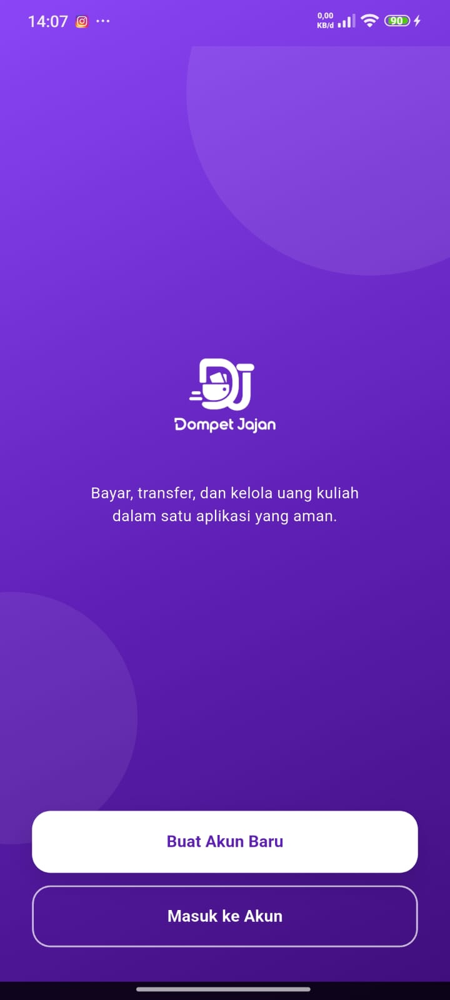 |  | 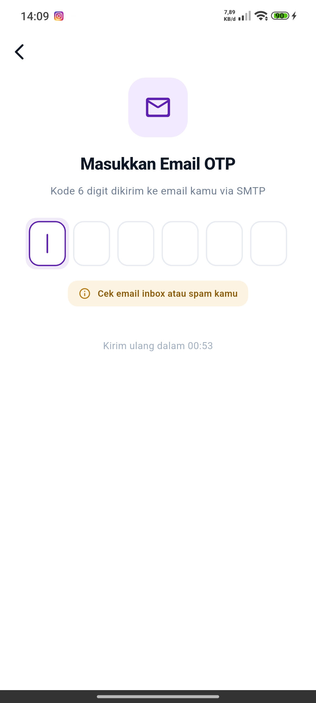 |
| 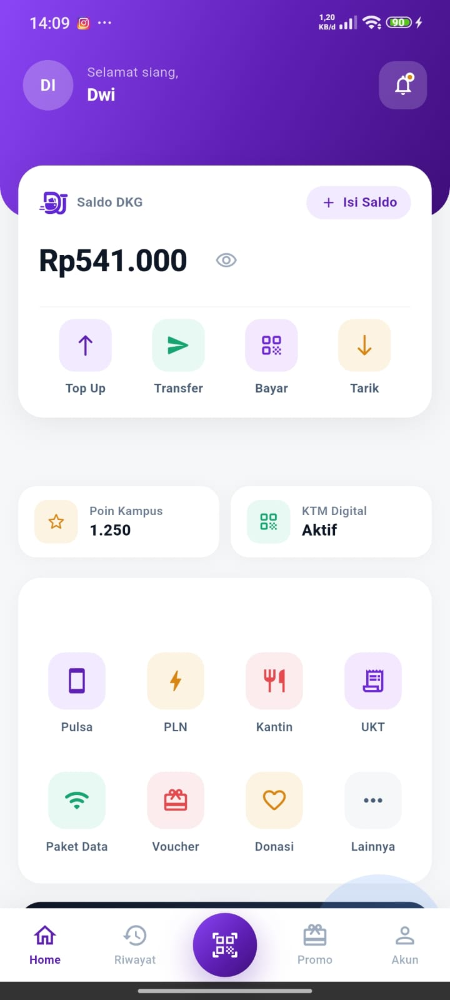 | 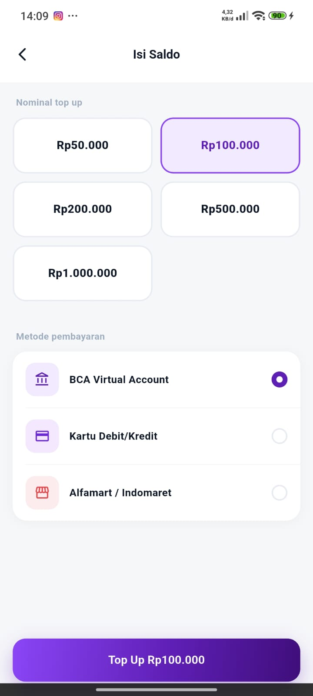 | 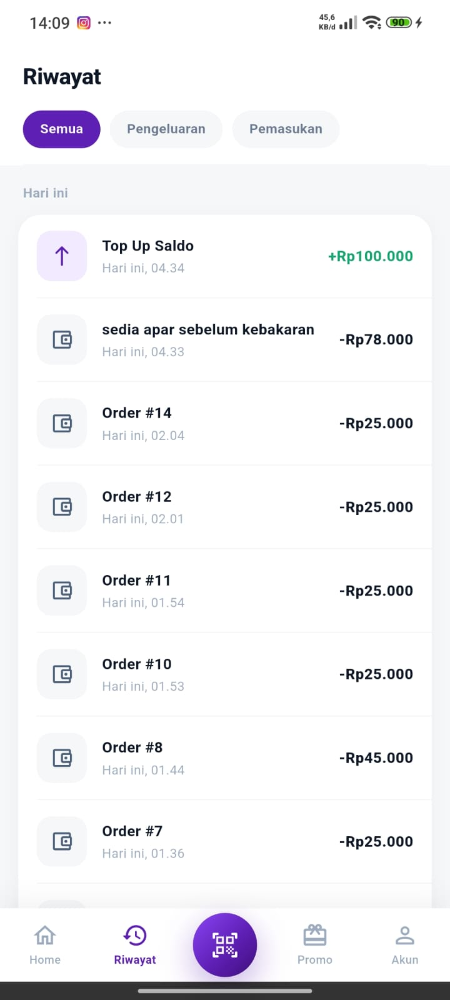 |
| 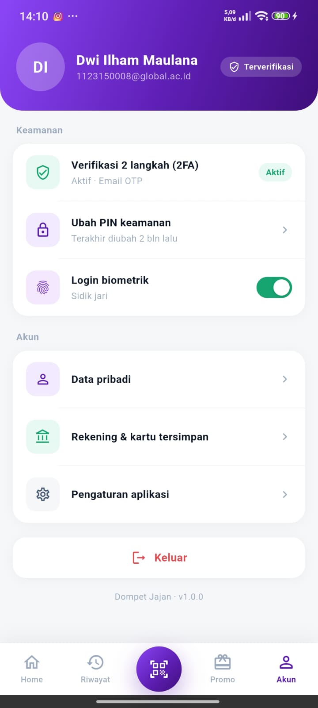 | 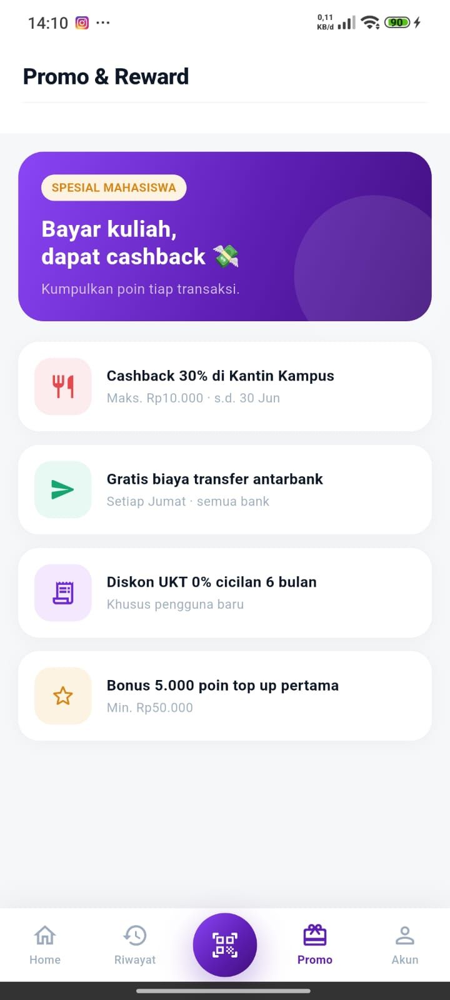 | 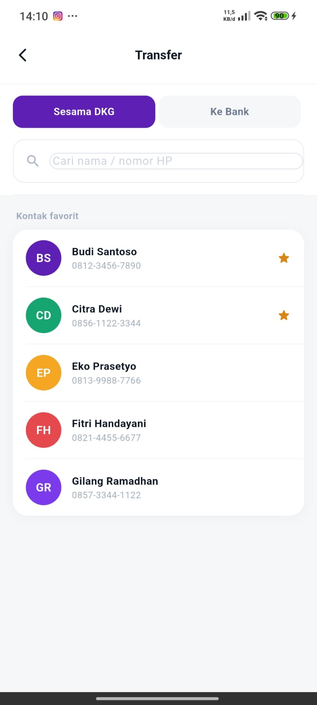 |
| 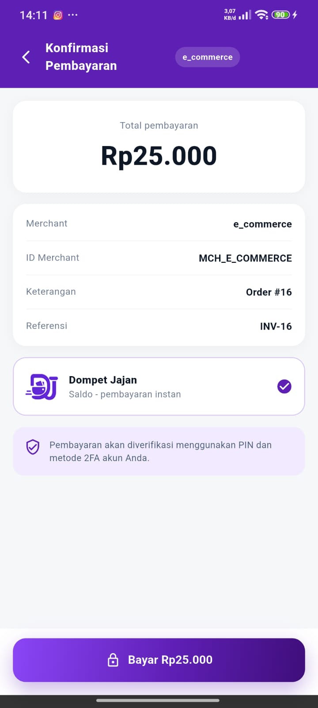 | | |

### Integrasi E-Commerce

| | | |
| --- | --- | --- |
| 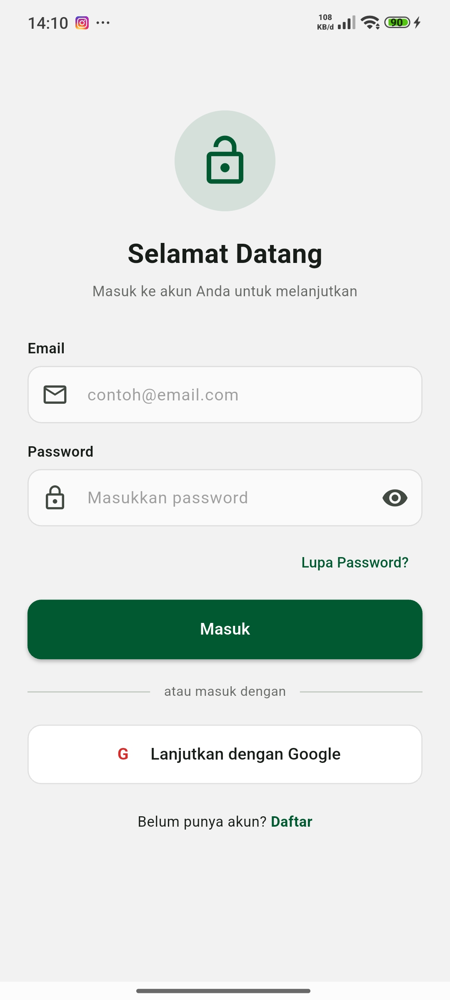 | 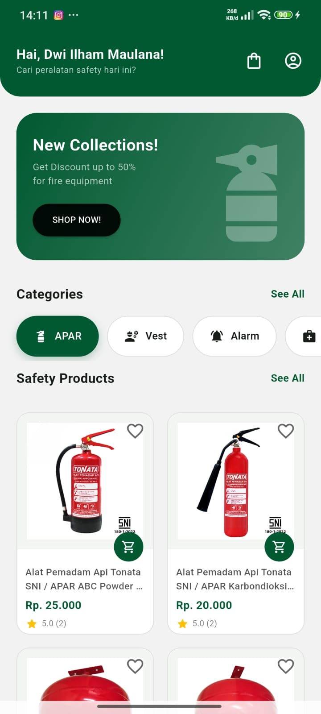 | 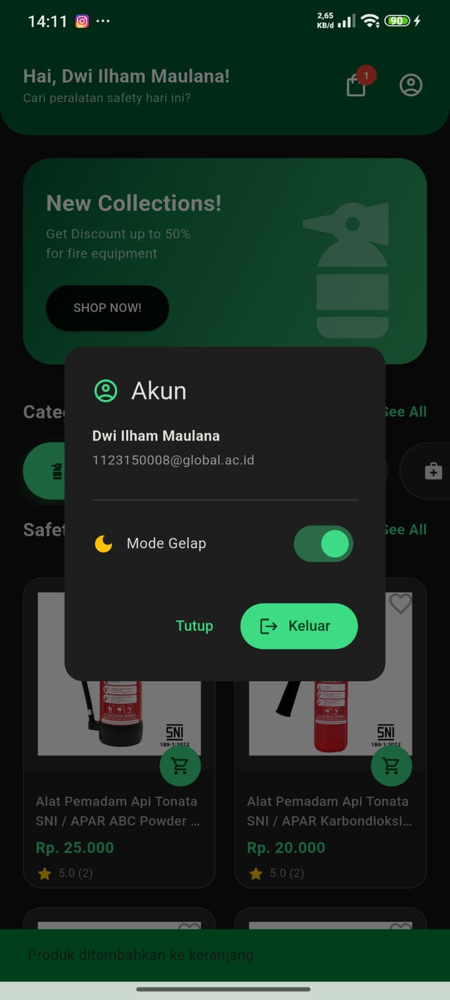 |
| 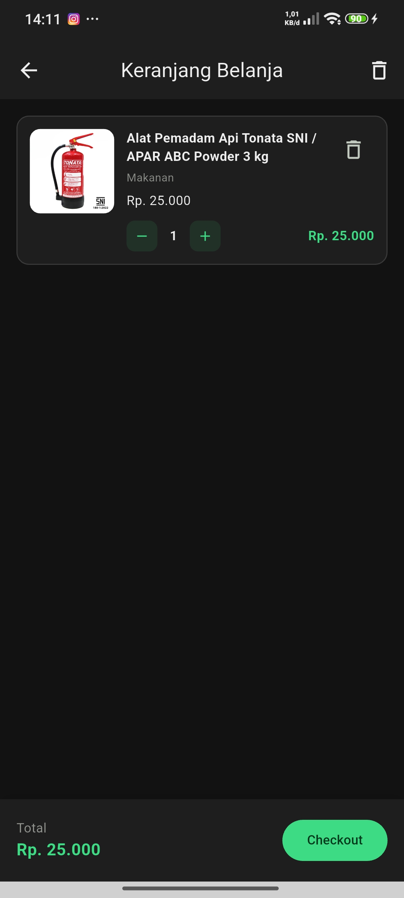 | 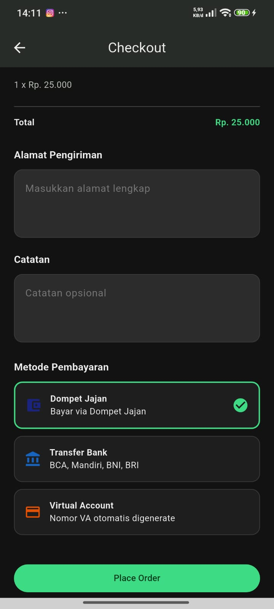 | 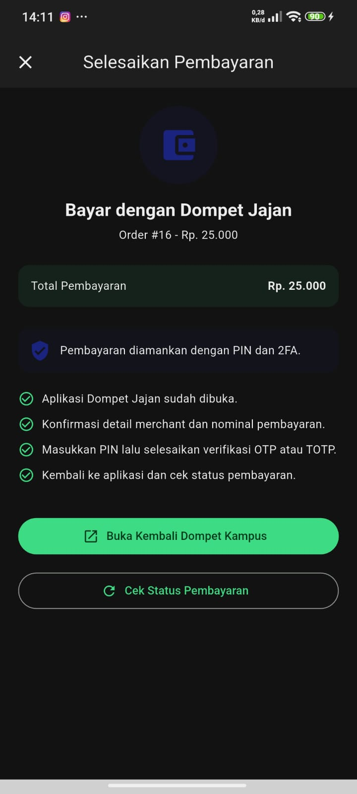 |
| 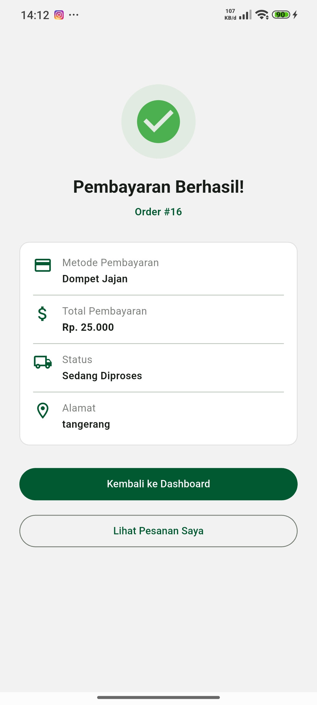 | | |

## Video Presentasi

<p align="center">
  
</p>

<p align="center">
  <a href="https://youtu.be/D5u48pCRPgg">Tonton video presentasi</a>
</p>

## Checklist UAS

| Kriteria | Status |
| --- | --- |
| Aplikasi E-Money tersedia | Selesai |
| Backend E-Money tersedia | Selesai |
| Integrasi deep link dari E-Commerce ke E-Money | Selesai |
| Callback pembayaran dari E-Money ke E-Commerce | Selesai |
| Autentikasi Firebase | Selesai |
| 2FA | Selesai |
| FCM | Selesai |
| APK dapat dibuild | Selesai |
| README berisi cara menjalankan dan test manual | Selesai |
| Screenshot dan video presentasi | Selesai |
